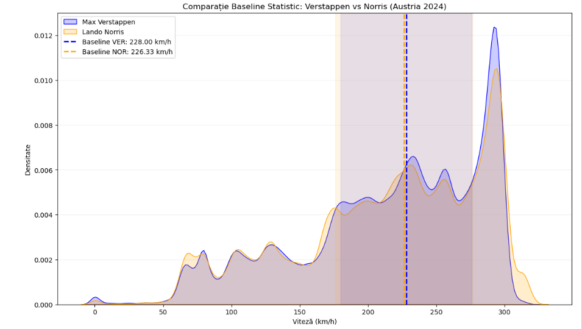

# Time Series Anomaly Detection: 2024 WDC Contenders Performance Analysis

This project analyzes the performance of the 2024 Formula 1 World Drivers' Championship (WDC) contenders using advanced time-series anomaly detection. We focus on pinpointing spatial and temporal deviations during critical races for top drivers like **Lando Norris** and **Max Verstappen**.

## 🏎️ Project Objective
A comparative, deep-dive telemetry analysis leveraging time-series data and spatial mapping to identify anomalies that signal sub-performance, tactical advantages, or technical irregularities.

## 🛠️ Methodology
The project implements the following algorithms to isolate and visualize performance anomalies:
* **MAD (Median Absolute Deviation):** Used for robust statistical detection of deviations within complex telemetry datasets, providing a threshold-based approach less sensitive to extreme outliers.
* **Isolation Forest:** An unsupervised machine learning algorithm applied to identify multi-dimensional anomalies within lap times, capturing non-linear relationships in performance dips.
* **LOF (Local Outlier Factor):** Utilised to detect anomalies in the **gap to leader**, identifying local density deviations where a driver's pace significantly diverges from the immediate competitive group.
* **Spatial Anomaly Mapping:** Anomalies are projected onto GPS circuit coordinates to identify specific corners or sectors where performance deviated from the expected baseline.

## 📊 Spatial Anomaly Insights

### 1. Spielberg - Austria (Red Bull Ring)
Comparison of spatial anomalies during the Austrian Grand Prix.

### 2. São Paulo - Brazil (Interlagos)
Comparison of spatial anomalies during the high-stakes São Paulo Grand Prix.

## 📂 Project Structure
* `F1_Anomaly_Detection_Analysis.ipynb`: Main Jupyter Notebook with data processing, modeling, and evaluation.
* `Plots_Formula_1/`: Directory containing all generated visualizations, including track-maps and statistical distributions.

---

### ⚠️ Legal & Copyright

© 2026 Tudoroiu Carmen-Mihaela. All rights reserved. 

This project is for portfolio demonstration only. No part of this repository may be reproduced, distributed, or transmitted in any form or by any means, including photocopying, recording, or other electronic or mechanical methods, without the prior written permission of the author.

---
*Analysis conducted for the 2024 F1 Season.*
